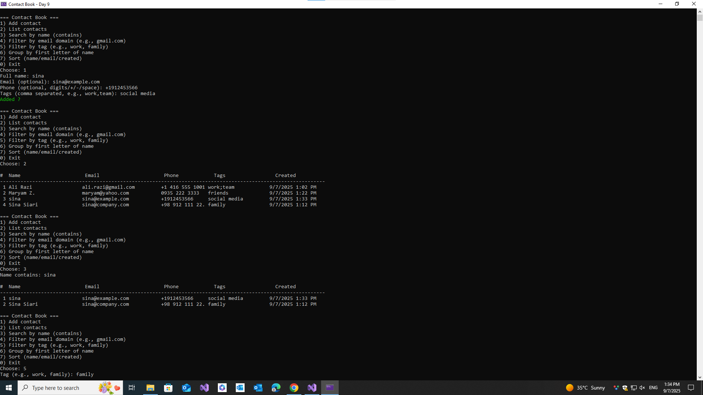

# 📒 Contact Book (C# Console App)

This is **Day 9** of my 30-Day C# Project-Based Learning Plan.  
A simple **console-based Contact Book** built with **Collections** and **LINQ**.  
It allows you to add, search, filter, sort, and group contacts.

---

## 🚀 Features
- Add new contacts with **Name, Email, Phone, Tags**  
- List all contacts in a formatted table  
- Search contacts by **name substring**  
- Filter by **email domain** (e.g., gmail.com)  
- Filter by **tag** (work, family, friends)  
- Group by **first letter of name**  
- Sort contacts by **name, email, or created date**  
- Input validation (basic email & phone checks)  
- Colored console output  

---

## 🛠️ Technologies
- Language: **C#**  
- Framework: **.NET 6/7/8**  
- IDE: Visual Studio  

---

# 📸 Screenshots

| 📒 |
|-----|
|  |

---

## 📚 Learning Goals

This project introduces:

- Collections (List<T>) for storing objects

- LINQ queries (Where, OrderBy, GroupBy, Any, etc.)

- Basic Regex validation for email and phone

- Building a menu-driven app with filter/search/sort functionality
